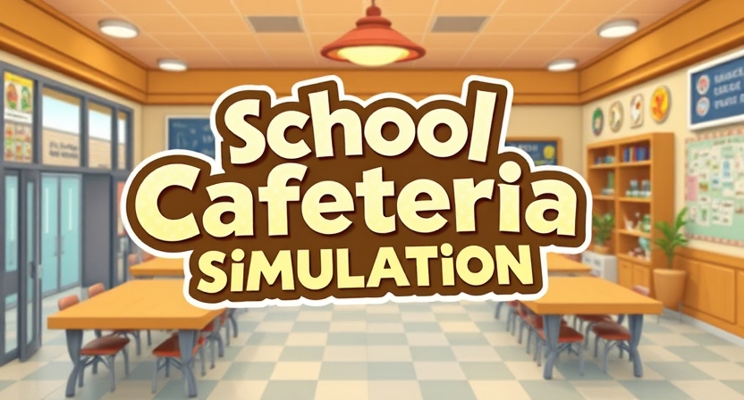
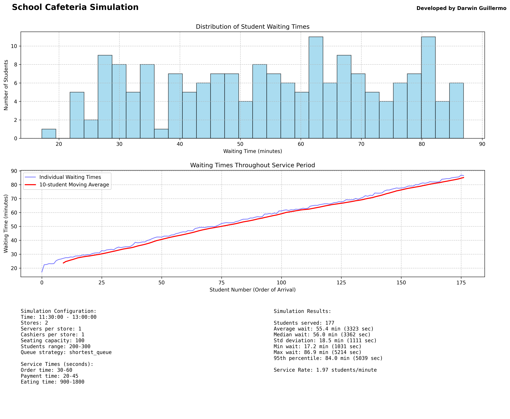

&nbsp;

# 🍽️ School Cafeteria Simulation

This project simulates the operations of a school cafeteria using the SimPy library. It models the behavior of students arriving at the cafeteria, waiting in line, and being served by cashiers and servers.

## ✨ Features

- Simulates student arrivals and service times
- Models multiple stores within the cafeteria
- Tracks waiting times and queue lengths
- Generates plots for analysis

&nbsp;

## 🙏 Acknowledgements

- [SimPy](https://simpy.readthedocs.io/en/latest/)
- [Mathplotlib](https://matplotlib.org/)
- [Numpy](https://numpy.org/)
  &nbsp;

## 🧑 Author

- [@DarwinRG](https://github.com/DarwinRG)

&nbsp;

## 📒 Requirements

- Python 3.13
- SimPy
- Matplotlib
- NumPy

&nbsp;

## 🛠️ Installation

### 📥 Downloading or Cloning the Repository

You can download the repository as a ZIP file and extract it, or you can clone the repository using Git.

#### 📦 Downloading as ZIP

1. Click the "Code" button on the repository page.
2. Select "Download ZIP".
3. Extract the ZIP file to your desired location.

#### 🌀 Cloning with Git

1. Open a terminal.
2. Run the following command to clone the repository:

```sh
git clone https://github.com/DarwinRG/School-Cafeteria-Simulation.git
```

3. Navigate to the project directory:

```sh
cd School-Cafeteria-Simulation
```

### ⚙️ Initial Setup

1. Create a Virtual Environment
   Open a terminal and navigate to the project directory. Then run the following command to create a virtual environment:

```sh
python -m venv .venv
```

2. Activate the Virtual Environment
> "Remember to re-run this command each time you restart your IDE."
```sh
.\.venv\Scripts\activate
```

3. Install Required Packages
   Once the virtual environment is activated, install the required packages using the following command:

```sh
pip install -r requirements.txt
```

&nbsp;

## 🔧 Environment Variables

To run this project, you will need to configure the following variables to the **config.py**

| Variable Name            | Default Value    | Description                |
| ------------------------ | ---------------- | -------------------------- |
| SIMULATION_START_TIME    | 41400            | 11:30 AM                   |
| SIMULATION_END_TIME      | 46800            | 1:00 PM                    |
| STORES                   | 2                | Number of stores           |
| SERVERS_PER_STORE        | 1                | Servers at each store      |
| CASHIERS_PER_STORE       | 1                | Cashiers at each store     |
| MEAL_CHOICES_PER_STORE   | 5                | Available meal options     |
| SEATING_CAPACITY         | 100              | Total seats available      |
| MIN_STUDENTS             | 200              | Minimum number of students |
| MAX_STUDENTS             | 300              | Maximum number of students |
| SKIP_LINE_PROBABILITY    | 0.1              | 10% chance to skip line    |
| MIN_ORDER_TIME           | 30               | 30 seconds                 |
| MAX_ORDER_TIME           | 60               | 1 minute                   |
| MIN_PAYMENT_TIME         | 20               | 20 seconds                 |
| MAX_PAYMENT_TIME         | 45               | 45 seconds                 |
| MIN_EATING_TIME          | 900              | 15 minutes                 |
| MAX_EATING_TIME          | 1800             | 30 minutes                 |
| STORE_SELECTION_STRATEGY | "shortest_queue" | Queue selection method     |

&nbsp;

## ▶️ Running the Simulation

After setting up the environment and installing the dependencies, you can run the simulation with:

```sh
python main.py
```

&nbsp;

## 📊 Output

After running the simulation, the program will generate an output in your terminal and save the results in png file along with a plot.

```
Example file in the results folder:

Format|Program Name|Date|Time
cafeteria_simulation_20241102_132716.png
```

### 📈 Result



&nbsp;

## 📜 License

This project is licensed under the Apache License 2.0. See the [LICENSE](LICENSE) file for details.
